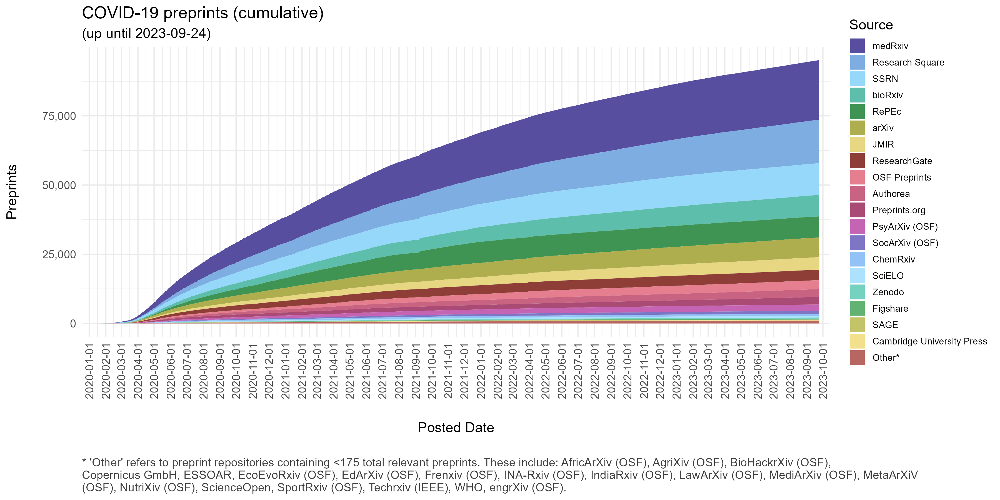
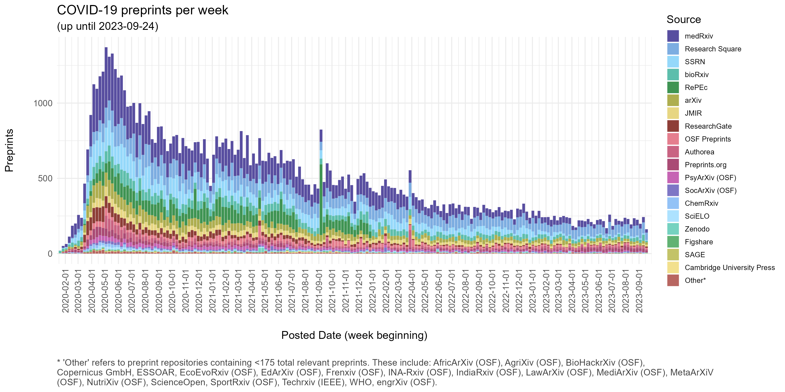

# COVID-19 Preprints

This repository contains code used to extract details of preprints related to COVID-19 and visualize their distribution over time. Work by [Nicholas Fraser](https://orcid.org/0000-0002-7582-6339) and [Bianca Kramer](https://orcid.org/0000-0002-5965-6560). 

Preprint data is currently updated on a biweekly schedule by collecting preprints added or updated since the previous sample date. Details of the current release can be found in `data/metadata.json`, where `release_date` refers to the date on which the dataset was released, `sample_date` the date on which data was collected, and `posted_date` the cut-off point for preprints to be included in the accompanying visualizations based on their posting date.

A citable version of this repository is also available on figshare, here: [https://doi.org/10.6084/m9.figshare.12033672](https://doi.org/10.6084/m9.figshare.12033672).

Note that this dataset is not exhaustive, but aims to collate information from some of the main sources of preprint metadata.

The process for collecting preprint metadata is documented fully [here](covid19_preprints.md). In general terms, preprint metadata are harvested from four main sources: 

* Crossref (using the [rcrossref](https://github.com/ropensci/rcrossref) package). All records with the `type` field defined as `posted-content` and `subtype` field defined as `preprint`are harvested, as well as records from SSRN (where the `type` field is instead defined as `journal-article`). Preprint records are then matched to known preprint repositories based on `institution`, `publisher` and `group-title` metadata fields.

* DataCite (using the [rdatacite](https://github.com/ropensci/rdatacite) package). All records with the `resourceType` or `resourceTypeGeneral` field defined as `Preprint` are harvested.  Preprint records are matched to known preprint repositories based on `client` fields.

* arXiv (using the [aRxiv](https://github.com/ropensci/aRxiv) package). Records are harvested by searching directly for COVID-19 related keywords in titles or abstracts using the built-in search functionality of the arXiv API.

* RePEc (using the [oai](https://github.com/ropensci/oai) package)). All record types are initally harvested, and subsequently filtered for those with the `Type` field defined as `preprint`. NB RePEc is not a preprint server in itself but an indexing server for multiple individual archives.

Note: For some time periods (e.g. between 2021-07-15 and 2021-09-08) no new preprints got retrieved from RePEc.

For all sources, preprints are classified as being related to COVID-19 on the basis of keyword matches in their titles or abstracts (where available). The search string is defined as: `coronavirus OR covid-19 OR sars-cov OR ncov-2019 OR 2019-ncov OR hcov-19 OR sars-2`.

In some cases, multiple preprint metadata records are registered for a single preprint (e.g. ChemRxiv registers a new Crossref record for each new version of a preprint). In these cases, only the earliest posted version is included in this dataset. Depuplication is done based on versioning information in dois as well as on case-insensitive title-matching. Additionally, some preprints are deposited to multiple preprint repositories - in these cases all preprint records are included.

