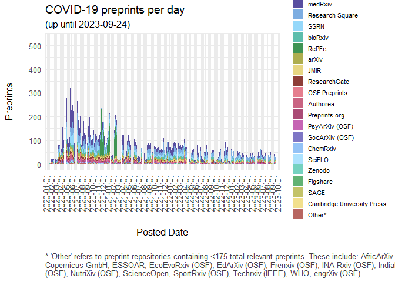
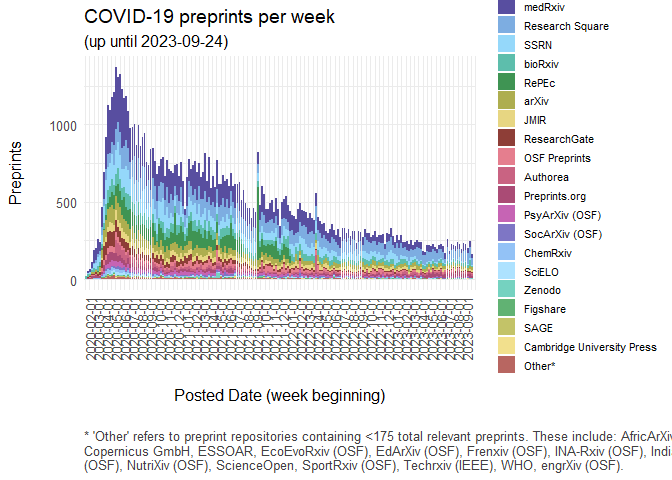
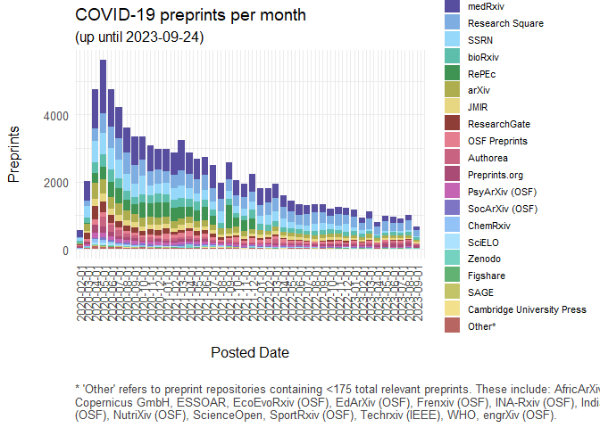
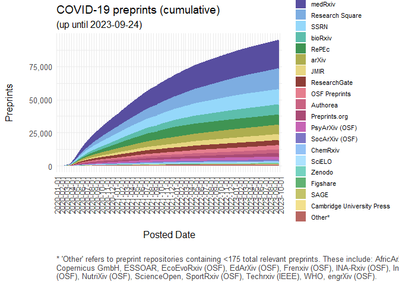
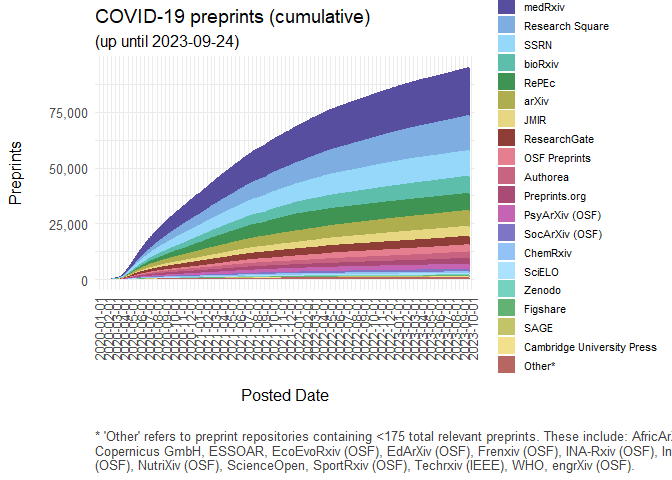

COVID-19 Preprints
================

# Background

This file contains code used to harvest metadata of COVID-19 related
preprints.

Currently, data are harvested from three sources:

1.  Crossref (using the
    [rcrossref](https://github.com/ropensci/rcrossref) package)
2.  DataCite (using the
    [rdatacite](https://github.com/ropensci/rdatacite) package)
3.  arXiv (using the [aRxiv](https://github.com/ropensci/aRxiv) package)
4.  RePEc (using the [oai](https://github.com/ropensci/oai) package)

A description of the methods for harvesting data sources is provided in
each relevant section below.

# Load required packages

``` r
# clear previous output
#rm(list=ls())

library(aRxiv)
library(jsonlite)
library(lubridate)
library(oai)
library(ratelimitr)
library(rcrossref)
library(rdatacite)
library(rvest)
library(tidyverse)
```

# Set sample date and posted date

# Retrieve the latest sample date for preprints

Note: run update from previous sample date (inclusive) to ensure no
records are missed that were added/updated on the previous sample date.
Deduplicate final dataset to filter out records that are sampled twice.

``` r
sample_date_until <- Sys.Date()
#sample_data_until <- as.Date("2023-04-30")

posted_date_until <-floor_date(sample_date_until, "week") #set to last Sunday prior to sample date

sample_date_from <- fromJSON("data/metadata.json") %>%
  .$sample_date %>%
  as.Date()

#NB use dates in character format for API queries
```

# Crossref

Harvesting of Crossref metadata is carried out using the
[rcrossref](https://github.com/ropensci/rcrossref) package for R. In
general, preprints are indexed in Crossref with the ‘type’ field given a
value of ‘posted-content’. The `cr_types_` function can therefore be
used to retrieve all metadata related to records with the type of
‘posted-content’, filtered for the period between the latest and current
sample date of this analysis.

‘index-date’ is used for running updates. According to [Crossref REST
API
documentation](https://github.com/CrossRef/rest-api-doc#notes-on-incremental-metadata-updates):
“the timestamp that from-index-date filters on is guaranteed to be
updated every time there is a change to metadata requiring a reindex.”

Also, entries with a ‘posted date’ after the sample date are not
filtered out, as these will not necessarily be retrieved in subsequent
updated when using ’index-date”. These records are filtered out in the
charts created from the data.

Note that here, the ‘low level’ `cr_types_` function is used to return
all metadata in list format, as this also includes some fields
(e.g. abstract) that are not returned by the ‘high level’ `cr_types`
function.

``` r
cr_expected_results <- cr_types(types = "posted-content",
                                works = TRUE,
                                limit = 1,
                                filter = c(from_index_date = as.character(sample_date_from),
                                           until_index_date = as.character(sample_date_until))
                                )$meta$total_results


# Query posted content
cr_posted_content <- cr_types_(types = "posted-content",
                               works = TRUE, 
                               filter = c(from_index_date = as.character(sample_date_from), 
                                           until_index_date = as.character(sample_date_until)),
                               limit = 1000, 
                               cursor = "*",
                               parse = TRUE,
                               cursor_max = 1000000,
                               .progress = TRUE)

cr_returned_results <- map_dbl(cr_posted_content, ~ length(.x$message$items)) %>% sum()
```

Relevant preprint metadata fields are parsed from the list format
returned in the previous step, to a more manageable data frame. Note the
‘institution’, ‘publisher’ and ‘group-title’ fields are retained, to be
later used to match preprints to specific preprint repositories.

``` r
# Function to parse posted "date parts" to more useful YYYY-MM-DD format
parseCrossrefPostedDate <- function(posted) {
  if(length(posted$`date-parts`[[1]]) == 3) {
    ymd(paste0(sprintf("%02d", unlist(posted$`date-parts`)), collapse = "-"))
  } else {
    NA
  }
}

# Function to parse Crossref preprint data to data frame
parseCrossrefPreprints <- function(item) {
  tibble(
    institution = if(length(item$institution[[1]]$name)) as.character(item$institution[[1]]$name) else NA_character_,
    publisher = as.character(item$publisher),
    group_title = if(length(item$`group-title`)) as.character(item$`group-title`) else NA_character_,
    cr_member_id = as.character(item$member),
    identifier = as.character(item$DOI),
    identifier_type = "DOI",
    #For posted_content, include subtype
    subtype = if(length(item$subtype)) as.character(item$subtype) else NA_character_,
    title = as.character(item$title[[1]]),
    # For posted-content, use the 'posted' date fields for the relevant date.
    # For SSRN preprints, use the 'created' date
    posted_date = if(length(item$posted)) parseCrossrefPostedDate(item$posted) else parseCrossrefPostedDate(item$created),
    abstract = if(length(item$abstract)) as.character(item$abstract) else NA_character_
  )
}

# Iterate over posted-content list and build data frame
cr_posted_content_df <- map_dfr(cr_posted_content, 
                                ~ map_df(.$message$items, parseCrossrefPreprints))

rm(cr_posted_content)
```

In the final step, preprints are subsetted to include only those related
to COVID-19, and the respective preprint repository of each identified.
NB Deduplication of versions is done at a later stage.

``` r
# Build a search string containing terms related to COVID-19
search_string <- "coronavirus|covid-19|sars-cov|ncov-2019|2019-ncov|hcov-19|sars-2"

cr_posted_content_covid <- cr_posted_content_df %>%
  # Filter COVID-19 related preprints
  filter(str_detect(title, regex(search_string, ignore_case = TRUE)) | 
         str_detect(abstract, regex(search_string, ignore_case = TRUE))) %>%
  # Rule-based matching of preprints to repositories. For CSHL repositories, the
  # repository name (bioRxiv/medRxiv) is contained in the 'institution' field. For
  # others we can use the 'publisher' field, except for any preprint servers 
  # hosted on OSF in which we should use the 'group_title' field to ensure we get
  # the right repository.
  mutate(source = case_when(
    institution == "bioRxiv" ~ "bioRxiv",
    institution == "medRxiv" ~ "medRxiv",
    institution == "Earth and Space Science Open Archive" ~ "ESSOAR",
    institution == "ScienceOpen" ~ "ScienceOpen",
    publisher == "Research Square" ~ "Research Square",
    publisher == "Research Square Platform LLC" ~ "Research Square",
    publisher == "MDPI AG" ~ "Preprints.org",
    publisher == "American Chemical Society (ACS)" ~ "ChemRxiv",
    publisher == "JMIR Publications Inc." ~ "JMIR",
    publisher == "WHO Press" ~ "WHO",
    publisher == "ScienceOpen" ~ "ScienceOpen",
    publisher == "SAGE Publications" ~ "SAGE",
    publisher == "FapUNIFESP (SciELO)" ~ "SciELO",
    publisher == "Institute of Electrical and Electronics Engineers (IEEE)" ~ "Techrxiv (IEEE)",
    publisher == "Authorea, Inc." ~ "Authorea",
    publisher == "Copernicus GmbH" ~ "Copernicus GmbH",
    publisher == "Cambridge University Press (CUP)" ~ "Cambridge University Press",
    group_title == "PsyArXiv" ~ "PsyArXiv (OSF)",
    group_title == "NutriXiv" ~ "NutriXiv (OSF)",
    group_title == "SocArXiv" ~ "SocArXiv (OSF)",
    group_title == "EdArXiv" ~ "EdArXiv (OSF)",
    group_title == "MediArXiv" ~ "MediArXiv (OSF)",
    group_title == "AfricArXiv" ~ "AfricArXiv (OSF)",
    group_title == "EarthArXiv" ~ "EarthArXiv (OSF)",
    group_title == "IndiaRxiv" ~ "IndiaRxiv (OSF)",
    group_title == "EcoEvoRxiv" ~ "EcoEvoRxiv (OSF)",
    group_title == "INA-Rxiv" ~ "INA-Rxiv (OSF)",
    group_title == "MetaArXiv" ~ "MetaArXiV (OSF)",
    group_title == "engrXiv" ~ "engrXiv (OSF)",
    group_title == "SportRxiv" ~ "SportRxiv (OSF)",
    group_title == "LawArXiv" ~ "LawArXiv (OSF)",
    group_title == "Frenxiv" ~ "Frenxiv (OSF)",
    group_title == "MetaArXiV" ~ "MetaArXiV (OSF)",
    group_title == "AgriXiv" ~ "AgriXiv (OSF)",
    group_title == "BioHackrXiv" ~ "BioHackrXiv (OSF)",
    group_title == "Open Science Framework" ~ "OSF Preprints"
  )) %>%
  # Remove those that could not be unambiguously matched or do not seem to be
  # "true" preprints
  filter(!is.na(source)) %>%
  # Remove publication types posted as 'posted-content' that are not preprints (e.g. conference abstracts, posters)
  filter(subtype == "preprint") %>%
  # Select only relevant fields with unique values
  distinct(source, identifier, identifier_type, posted_date, title, abstract)

rm(cr_posted_content_df)
```

A side effect of the above procedure is that some preprint servers, most
notably SSRN, instead index their content with the ‘type’ set to
‘journal-article’, and are thus not included when querying only for
‘posted-content’ types. Metadata of SSRN preprints are thus instead
harvested using the `cr_works_` function for the ISSN of SSRN
(1556-5068).

``` r
cr_ssrn_expected_results <- cr_works(filter = c(issn = "1556-5068",
                                                 from_index_date = as.character(sample_date_from),
                                                until_index_date = as.character(sample_date_until)), 
                                     limit = 1)$meta$total_results

# Query SSRN preprints
cr_ssrn <- cr_works_(filter = c(issn = "1556-5068",
                                from_index_date = as.character(sample_date_from),
                                until_index_date = as.character(sample_date_until)), 
                     limit = 1000,
                     cursor = "*",
                     parse = TRUE,
                     cursor_max = cr_ssrn_expected_results)

cr_ssrn_returned_results <- map_dbl(cr_ssrn, ~ length(.x$message$items)) %>% sum()

# Iterate over SSRN list and build data frame
cr_ssrn_df <- map_df(cr_ssrn, ~ map_dfr(.x$message$items, parseCrossrefPreprints))

rm(cr_ssrn)
```

An inspection of the published dates of SSRN preprints indicates some
abnormalities, e.g. on 24th March 2020, more than 5000 SSRN preprints
were published according to dates from Crossref - the next highest day
only has \~250 published preprints. Manual inspection of a small number
suggests that the published date in Crossref does not correspond well to
the actual published date according to the SSRN website. Thus, we can
subset our set of SSRN preprints to those related to COVID-19 (to reduce
the number of articles), and harvest more accurate publication dates by
directly crawling the SSRN website (using the
[rvest](https://github.com/tidyverse/rvest) package).

``` r
getSSRNPublicationDate <- function(doi) {
  
  #in case requests time out (http error 429), use rate limiting
  Sys.sleep(10)
  
  # Base URL for querying
  base_url <- "https://doi.org/"
  url <- paste0(base_url, doi)
  
  posted_date <- tryCatch({
    # Read page URL and select relevant node
    d <- read_html(url) %>%
      html_nodes("meta[name='citation_online_date'][content]") %>%
      html_attr('content')
    # Sometimes the doi resolves to an empty page (for papers that  have been removed from SSRN) - in these cases return NA
    # NAs are also returned when a 429 error (time out) occurs - if this happens, employ rate limiting step in first line of function
    if(length(d)) d else NA
  },
  error = function(e) {
    NA
  })
  
  return(posted_date)
}

# Create the final SSRN dataset. Deduplication of versions is done at a later stage.

cr_ssrn_covid <- cr_ssrn_df %>%  
  # Filter COVID-19 related preprints. SSRN metadata does not contain abstracts
  filter(str_detect(title, regex(search_string, ignore_case = TRUE))) 

#Filter on records not already in dataset (to reduce the number of records for which to crawl the SSRN website)

covid_preprints_previous <- read_csv("data/covid19_preprints.csv") %>%
  pull(identifier)

cr_ssrn_covid <- cr_ssrn_covid %>%
  filter(!identifier %in% covid_preprints_previous)
  
rm(covid_preprints_previous)

#crawl SSRN to retrieve posted dates
cr_ssrn_covid <- cr_ssrn_covid %>%
  # Retrieve 'real' posted dates from the SSRN website. Warning: slow
  mutate(posted_date = ymd(map_chr(identifier, getSSRNPublicationDate)),
         source = "SSRN") %>%
  # Select only relevant fields with unique values
  distinct(source, identifier, identifier_type, posted_date, title, abstract)

rm(cr_ssrn_df)
```

The datasets derived from “posted-content” and from SSRN are merged to a
final Crossref dataset

``` r
cr_covid <- bind_rows(cr_posted_content_covid, cr_ssrn_covid)

rm(cr_posted_content_covid, cr_ssrn_covid)
```

# DataCite

For harvesting of Datacite metadata the
[rdatacite](https://github.com/ropensci/rcrossref) package for R was
used. In general, preprints are indexed in Datacite with the
‘resourceTypeGeneral’ field set to ‘Preprint’. Prior to DataCite
metadata schema 4.4, the field ‘resourceType’ was used to indicate
preprints. This field is not strictly controlled though, so not all
preprints will have been caught this way.

As of 2022, arXiv also uses DataCite DOIs, with all backfiles receiving
DataCite DOIs over the course of 2022. To prevent including this arXiv
backlog, DataCite harvesting is limited to ResearchGate, Zenodo and
Figshare.

Results can be filtered on date of creation (year only). To retrieve
over 1000 results, either pagination or a cursor parameter can be used.
Since pagination only allows to retrieve the first 10,000 records, the
cursor parameter is used, which allows retrieval of \> 10,000 records.
Because this method uses output from each iteration (cursor value) as
input in the next iteration, currently a for loop is used instead of
purrr::map.

``` r
##specify years to include
#dc_years <- c("2020", "2021", "2022")
dc_years <- c("2023") # for iterative update, only need to use 2023 from next update onwards

###include (not: replace) query for types.resourceTypeGeneral:Preprint as per DataCite metadata schema 4.4
dc_types <- c("types.resourceType:Preprint",
              "types.resourceTypeGeneral:Preprint")

## limit query to clients rg.rg, figshare.ars and cern.zenodo 
dc_clients <- c("rg.rg", "cern.zenodo", "figshare.ars")

#create cartesian product of types and clients
cartesian <- cross3(dc_types, dc_clients, dc_years)

dc_types_cartesian <- map(cartesian, 1) %>% unlist()
dc_clients_cartesian <- map(cartesian, 2) %>% unlist()
dc_years_cartesian <- map(cartesian, 3) %>% unlist()

dc_parameters <- list(dc_types_cartesian,
                      dc_clients_cartesian,
                      dc_years_cartesian)
  
##initial query to get number of results
getDataCiteCount <- function(type, client, year){
  dois <- dc_dois(query = type,
                  client_id = client,
                  created = year,
                  limit = 1)
  res <- list(
    query = type,
    year = year,
    total = dois$meta$total)
  return(res)
}

##retrieve expected results per year
dc_expected_results <- pmap(dc_parameters,
                            getDataCiteCount) %>%
  map("total") %>%
  map_int(sum) %>%
  sum()
    
##define function to execute Datacite iteratively
getDataCitePreprints <- function(type, client, year){
  
  #initialize output variable as list
  #set initial cursor value = 1
  var <- list()
  cursor_value = 1
  
  #set encoded type
  type_encoded <- str_replace(type, ":", "%3A")
  
  #initial query to get number of results for pagination
  dois <- dc_dois(query = type,
                  client_id = client,
                  created = year,
                  limit = 1)
  total <- dois$meta$total
  
  seq <- c(1:ceiling(total/1000))
  seq <- seq[!seq == 0] #catch error when total = 0
  
  #Iteratively query DataCite using cursor
  for (i in seq){
    
    Sys.sleep(1) #don't hit the API too hard
     res <- dc_dois(query = type, 
                    client_id = client,
                    created = year,
                    limit = 1000,
                    cursor = cursor_value)
     #extract new cursor value
     cursor_value <- res$links$"next" %>%
     #escape "?"
     #manually adapt limit if not 1000
     str_remove(paste0("https://api.datacite.org/dois\\?client-id=",
                       client,
                       "&created=",
                        year,
                        "&page%5Bcursor%5D=")) %>%
     str_remove(paste0("&page%5Bsize%5D=1000&query=",
                       type_encoded))
  
    var[[i]] <- res
    
    var
    
    }
  
  return(var)
  
}


dc_preprints <- pmap(dc_parameters,
                     getDataCitePreprints) %>%
  purrr::flatten()

dc_returned_results <- dc_preprints %>%
  map_df("data") %>%
  nrow()

rm(dc_types, dc_clients, dc_years,
   dc_types_cartesian, dc_clients_cartesian, dc_years_cartesian, cartesian,
   dc_parameters)
```

Next, relevant preprint metadata fields are parsed from the list format
returned in the previous step, to a more manageable data frame. Note
that specific preprint repositories are encoded in the field ‘client’,
and abstracts are included in the field ‘descriptions’. The resulting
columns ‘title’ and ‘descriptions’ are list columns and need to be
processed further to extract the needed information.

``` r
parseDataCiteDescription <- function(x) {
  if(length(x) > 0) {
    #descriptionType and description are character vectors, spanning content of description field
    #testing (2022-08) found that selecting on "Abstract" could be omitted
    if("Abstract" %in% x$descriptionType) {
      return(str_to_sentence(str_c(x$description, collapse = "; ")))
    } else {
      return(NA_character_)
    }
  } else {
    return(NA_character_)
  }
}

parseDataCitePreprints <- function(item) {
  tibble(
    identifier = item$data$attributes$doi,
    identifier_type = "DOI",
    posted_date = as.Date(item$data$attributes$created),
    client = item$data$relationships$client$data$id,
    title = map_chr(item$data$attributes$titles, 
                    ~ str_to_sentence(str_c(.x$title, collapse = "; "))),
    abstract = map_chr(item$data$attributes$descriptions, 
                          function(x) parseDataCiteDescription(x)),
    abstract_length = map_int(item$data$attributes$descriptions,
                              function(x) length(x))
    )
}

dc_preprints_df <- map_df(dc_preprints, parseDataCitePreprints) %>%
  distinct()

rm(dc_preprints)
```

DataCite preprints are then subsetted to include only those related to
COVID-19, and the respective preprint repository of each identified. NB
Deduplication of versions is done at a later stage.

``` r
dc_covid <- dc_preprints_df %>%
  # Filter COVID-19 related preprints
  filter(str_detect(title, regex(search_string, ignore_case = TRUE)) | 
         str_detect(abstract, regex(search_string, ignore_case = TRUE))) %>%
  # Rule-based matching of preprints to repositories.
  # Repository names are encoded in field 'client.
  mutate(source = case_when(
    client == "rg.rg" ~ "ResearchGate",
    client == "figshare.ars" ~ "Figshare",
    client == "cern.zenodo" ~ "Zenodo",
    TRUE ~ NA_character_)) %>%
  # Remove those that could not be unambiguously matched
  filter(!is.na(source)) %>%
  # Select only relevant fields with unique values
  distinct(source, identifier, identifier_type, posted_date, title, abstract)

rm(dc_preprints_df)
```

# arXiv

ArXiv records are retrieved using the
[aRxiv](https://github.com/ropensci/aRxiv) package. aRxiv provides a
nice search functionality, so that we can search directly for our search
terms in the titles and abstracts of arXiv preprints, and return only
the relevant data. NB Deduplication of versions is done at a later
stage.

``` r
# For returning details of preprints on arXiv, we can use the aRxiv package and define title and abstract search strings
# Using the default batch size of 100 in often resulted in not all batches being run. Increasing batch size to 1000 appears to solve this. 


ar_search_string <- 'ti:coronavirus OR ti:covid OR ti:sars-cov OR ti:ncov-2019 ti:2019-ncov OR ti:hcov-19 OR ti:sars-2 OR abs:coronavirus OR abs:covid OR abs:sars-cov OR abs:ncov-2019 OR abs:2019-ncov OR abs:hcov-19 OR abs:sars-2'

ar_expected_results <- arxiv_count(ar_search_string)

ar_covid_df <- arxiv_search(ar_search_string,
                      limit = 10000,
                      batchsize = 1000)

ar_returned_results <- nrow(ar_covid_df)

ar_covid <- ar_covid_df %>% 
  mutate(source = "arXiv",
         identifier = id,
         identifier_type = "arXiv ID",
         posted_date = date(submitted)) %>%
  filter((posted_date >= as.character(sample_date_from)) & 
           (posted_date <= as.character(sample_date_until))) %>%
  select(source, identifier, identifier_type, posted_date, title, abstract) %>%
  distinct()

rm(ar_covid_df)
```

# RePEc

RePEc is a repository for research papers in Economics, containing
preprints as well as other research outputs (e.g. journal papers, books,
software components). There exist a number of methods for accessing
RePEc metadata, see an overview
[here](https://ideas.repec.org/getdata.html). Here we access RePEc
metadata using the (OAI-PMH)\[<https://www.openarchives.org/pmh/>\]
inteface with the package [oai](https://github.com/ropensci/oai).

Relevant metadata is extracted from each record, and only records with
the “type” field of “preprint” are retained. Records contain either one
or multiple “description” fields, the first of which generally (but not
always) contains the abstract. For now we extract only this first
description field. NB Deduplication of records is done at a later stage.

``` r
parseRepecPreprints <- function(item) {
    tibble(
      type = if(length(item$metadata$type)) item$metadata$type else NA_character_,
      source = "RePEc",
      identifier = if(length(item$headers$identifier)) str_remove(item$headers$identifier, "oai:") else NA_character_,
      identifier_type = "RePEc handle",
      posted_date = if(length(item$headers$datestamp)) item$headers$datestamp else NA_character_,
      title = if(length(item$metadata$title)) item$metadata$title else NA_character_,
      abstract = if(length(item$metadata$description[1])) item$metadata$description[1] else NA_character_
    )
}

# Get a list of all RePEc records posting between two dates
# Replaced http://oai.repec.openlib.org with http://oai.repec.org as OAI-PMH endpoint

start_date <- sample_date_from
end_date <- sample_date_until

getRepecPreprints <- function(start_date, end_date) {
  d <- oai::list_records("http://oai.repec.org", 
                         from = start_date, 
                         until = end_date, 
                         as = "list")
  repec_preprints <- map(d, parseRepecPreprints)
  return(repec_preprints)
}

#catch error if RePEc query does not return results
repec_covid <- tryCatch(
    {
      getRepecPreprints(sample_date_from,
                       sample_date_until) %>%
        bind_rows() %>% 
        filter(type == "preprint") %>%
        select(-type) %>%
        filter(str_detect(title, regex(search_string, ignore_case = TRUE)) | str_detect(abstract, regex(search_string, ignore_case = TRUE))) %>%
        mutate(posted_date = ymd(posted_date)) %>%
        # Select only relevant fields with unique values
        distinct(source, identifier, identifier_type, posted_date, title, abstract)
    },
    error = function(e){ 
      data.frame(source = character(),
                 identifier = character(),
                 identifier_type = character(),
                 posted_date = as.Date(character()),
                 title = character(),
                 abstract = character()
                 )
    }
)
```

# Create final dataset (bind Crossref, DataCite, arXiv and RePEc data)

``` r
covid_preprints_update <- bind_rows(cr_covid, 
                                    dc_covid, 
                                    ar_covid, 
                                    repec_covid) %>%
  select(source, identifier, identifier_type, posted_date, title, abstract)

#clean titles and abstracts (remove tags, leading string "Abstract", whitespace. Not attempted to remove other html-entities with regex)
covid_preprints_update <- covid_preprints_update %>%
  mutate(abstract = str_remove_all(abstract, "<jats:title>.*?</jats:title>"),
         abstract = str_remove_all(abstract, "<.*?>"),
         abstract = str_squish(abstract)) %>%
  mutate(title = str_remove_all(title, "<.*?>"),
         title = str_squish(title))


rm(cr_covid, dc_covid, ar_covid, repec_covid) 
```

\#Remove duplicate records (incl. versions) on same preprint server

``` r
covid_preprints_previous <- read_csv("data/covid19_preprints.csv")

covid_preprints <- bind_rows(covid_preprints_previous,
                             covid_preprints_update)

#Remove duplicate records (incl. versions) on same preprint serve
covid_preprints <- covid_preprints %>%
  # Some preprints have multiple records relating to multiple preprint versions.In many cases, the the DOI or other identifier is appended with a version number. This is the case for Authorea, ChemRxiv, Cambridge Engage, Essoar, Preprints.org, ResearchSquare, SAGE advance, ScienceOpen and Techrxiv (from Crossref), for Figshare and ResearchGate (from DataCite) and for arXiv.
  #Syntax used for appended version numbers varies, e.g. 10.1000/12345.v2, 10.1000/12345/v2, 10.1000/12345-v2, 2012.01234v2, 10.1000/12345/2 or 10.1000/12345.2
  # To ensure only a single record is counted per preprint, the version number is removed and only the earliest record is kept
   # Remove .v2, /v2 and -v2 at the end of a string, with a maximum of 3 digits
  mutate(
    identifier_clean = str_remove(
      identifier,
      "[\\.\\/\\-]v[0-9]{1,3}$")) %>%
   # Remove v2 at the end of a string, with a maximum of 2 digits, only for arXiv records (to prevent removal of strings that are not version numbers, e.g.in OSF records)
  mutate(identifier_clean = case_when(
    source == "arXiv" ~ str_remove(
      identifier,
      "v[0-9]{1,2}$"),
    TRUE ~ identifier_clean)) %>%
  # Remove .2 and /2 at the end of a string, with a maximum of 2 digits, only for Essoar and ResearchGate records (to prevent removal of strings that are not version numbers, e.g.in Repec and Scielo records)
  mutate(identifier_clean = case_when(
    source %in% c("ESSOAR", "ResearchGate") ~ str_remove(
      identifier,
       "[\\.\\/][0-9]{1,2}$"),
    TRUE ~ identifier_clean)) %>%
  # For preprints with version numbers, keep only earliest version 
  group_by(identifier_clean) %>%
  arrange(posted_date) %>%
  slice(1) %>%
  ungroup() %>%
  select(-identifier_clean) %>%
  # Additionally filter preprints with the same title posted on the same server, keeping only earliest version. Some duplicates differ in case, so convert titles to lower-case for deduplication
  mutate(title_clean = str_to_lower(title)) %>%
  group_by(source, title_clean) %>%
  arrange(posted_date) %>%
  slice(1) %>%
  ungroup() %>%
  select(-title_clean)


covid_preprints %>% 
  write_csv("data/covid19_preprints.csv")

rm(covid_preprints_previous, covid_preprints_update)
```

# Create metadata file (json file with sample date and release date)

``` r
# Set system date as release date
release_date <- Sys.Date()

# Create metadata as list
metadata <- list()

metadata$release_date <- release_date
metadata$sample_date <- sample_date_until
metadata$posted_date <- posted_date_until
metadata$url_data <- "https://doi.org/10.6084/m9.figshare.22707346"
metadata$url_repository <- "https://github.com/nicholasmfraser/covid19_preprints"

# Save as json file
metadata_json <- toJSON(metadata, pretty = TRUE, auto_unbox = TRUE)
write(metadata_json, "data/metadata.json")
```

# Visualizations

``` r
# Default theme options
theme_set(theme_minimal() +
          theme(text = element_text(size = 12),
          axis.text.x = element_text(angle = 90, vjust = 0.5),
          axis.title.x = element_text(margin = margin(20, 0, 0, 0)),
          axis.title.y = element_text(margin = margin(0, 20, 0, 0)),
          legend.key.size = unit(0.5, "cm"),
          legend.text = element_text(size = 8),
          plot.caption = element_text(size = 10, hjust = 0, color = "grey25", 
                                      margin = margin(20, 0, 0, 0))))

# Create a nice color palette
pal_1 <- colorspace::lighten(pals::tol(n = 10), amount = 0.2)
pal_2 <- colorspace::lighten(pals::tol(n = 10), amount = 0.4)
palette <- c(pal_1, pal_2)
```

``` r
# Minimum number of preprints to be included in graphs (otherwise too many categories/labels is confusing. Aim for 19 servers to include.)
n_min <- 175

# Repositories with < min preprints
other <- covid_preprints %>%
  filter(posted_date <= posted_date_until) %>%
  count(source) %>%
  filter(n < n_min) %>%
  pull(source)

fct_levels <- covid_preprints %>% 
  filter(posted_date <= posted_date_until) %>%
  mutate(source = case_when(
           source %in% other ~ "Other*",
           T ~ source
        )) %>%
  count(source) %>%
  arrange(desc(n)) %>%
  mutate(source = c(source[source != "Other*"], "Other*")) %>%
  pull(source)

other_text = paste0("* 'Other' refers to preprint repositories  containing <",
                    n_min, " total relevant preprints. These include: ",
                    paste(other, collapse = ", "), ".")

other_caption <- str_wrap(other_text, width = 150)
```

``` r
# daily preprint counts
covid_preprints %>%
  filter(posted_date <= posted_date_until) %>%
  filter(posted_date >= ymd("2020-01-13")) %>%
  mutate(source = case_when(
    source %in% other ~ "Other*",
    T ~ source
  ),
  source = factor(source, levels = fct_levels)) %>%
  count(source, posted_date) %>%
  ggplot(aes(x = posted_date, y = n, fill = source)) +
  geom_col() +
  labs(x = "Posted Date", y = "Preprints", fill = "Source",
       title = "COVID-19 preprints per day",
       subtitle = paste0("(up until ", posted_date_until, ")"),
       caption = other_caption) +
  scale_x_date(date_breaks = "1 month",
               date_minor_breaks = "7 days",
               expand = c(0.01, 0),
               limits = c(ymd("2020-01-13"), ymd(sample_date_until))) +
  scale_fill_manual(values = palette)
```

<!-- -->

``` r
ggsave("outputs/figures/covid19_preprints_day.png", width = 12, height = 6)
```

``` r
# Weekly preprint counts
covid_preprints %>%
  filter(posted_date <= posted_date_until) %>%
  filter(posted_date >= ymd("2020-01-13")) %>%
  mutate(
    source = case_when(
      source %in% other ~ "Other*",
      T ~ source
    ),
    source = factor(source, levels = fct_levels),
    posted_week = ymd(cut(posted_date,
                          breaks = "week",
                          start.on.monday = TRUE))) %>%
  count(source, posted_week) %>%
  ggplot(aes(x = posted_week, y = n, fill = source)) +
  geom_col() +
  labs(x = "Posted Date (week beginning)", y = "Preprints", fill = "Source",
       title = "COVID-19 preprints per week", 
       subtitle = paste0("(up until ", posted_date_until, ")"),
       caption = other_caption) +
  scale_x_date(date_breaks = "1 month",
               expand = c(0, 0),
               limits = c(ymd("2020-01-13"), ymd(sample_date_until))) +
  scale_fill_manual(values = palette)
```

<!-- -->

``` r
ggsave("outputs/figures/covid19_preprints_week.png", width = 12, height = 6)
```

``` r
# Monthly preprint counts
covid_preprints %>%
  filter(posted_date <= posted_date_until) %>%
  filter(posted_date >= ymd("2020-01-13")) %>%
  mutate(
    source = case_when(
      source %in% other ~ "Other*",
      T ~ source
    ),
    source = factor(source, levels = fct_levels),
    posted_month = ymd(cut(posted_date,
                          breaks = "month"))) %>%
  count(source, posted_month) %>%
  ggplot(aes(x = posted_month, y = n, fill = source)) +
  geom_col() +
  labs(x = "Posted Date", y = "Preprints", fill = "Source",
       title = "COVID-19 preprints per month", 
       subtitle = paste0("(up until ", posted_date_until, ")"),
       caption = other_caption) +
  scale_x_date(date_breaks = "1 month",
               expand = c(0, 0),
               limits = c(ymd("2020-01-13"),
                          ceiling_date(ymd(sample_date_until), 
                                       "month") - days(1))) +
  scale_fill_manual(values = palette)
```

<!-- -->

``` r
ggsave("outputs/figures/covid19_preprints_month.png", width = 12, height = 6)
```

``` r
# Cumulative daily preprint counts, by week
covid_preprints %>%
  filter(posted_date <= posted_date_until) %>%
  filter(posted_date >= ymd("2020-01-13")) %>%
  mutate(source = case_when(
      source %in% other ~ "Other*",
      T ~ source
    ),
    source = factor(source, levels = fct_levels)) %>%
  count(source, posted_date) %>%
  complete(posted_date, nesting(source), fill = list(n = 0)) %>%
  group_by(source) %>%
  arrange(posted_date) %>%
  mutate(cumulative_n = cumsum(n)) %>%
  ggplot() +
  geom_area(aes(x = posted_date, y = cumulative_n, fill = source)) +
  labs(x = "Posted Date", y = "Preprints", fill = "Source",
       title = "COVID-19 preprints (cumulative)", 
       subtitle = paste0("(up until ", posted_date_until, ")"),
       caption = other_caption) +
  scale_y_continuous(labels = scales::comma) +
  scale_x_date(date_breaks = "1 month",
               expand = c(0.01, 0),
               limits = c(ymd("2020-01-13"), ymd(sample_date_until) + 1)) +
  scale_fill_manual(values = palette)
```

<!-- -->

``` r
ggsave("outputs/figures/covid19_preprints_day_cumulative_by_week.png", width = 12, height = 6)
```

``` r
# Cumulative daily preprint counts, by month
covid_preprints %>%
  filter(posted_date <= posted_date_until) %>%
  filter(posted_date >= ymd("2020-01-13")) %>%
  mutate(source = case_when(
      source %in% other ~ "Other*",
      T ~ source
    ),
    source = factor(source, levels = fct_levels)) %>%
  count(source, posted_date) %>%
  complete(posted_date, nesting(source), fill = list(n = 0)) %>%
  group_by(source) %>%
  arrange(posted_date) %>%
  mutate(cumulative_n = cumsum(n)) %>%
  ggplot() +
  geom_area(aes(x = posted_date, y = cumulative_n, fill = source)) +
  labs(x = "Posted Date", y = "Preprints", fill = "Source",
       title = "COVID-19 preprints (cumulative)", 
       subtitle = paste0("(up until ", posted_date_until, ")"),
       caption = other_caption) +
  scale_y_continuous(labels = scales::comma) +
  scale_x_date(date_breaks = "1 month",
               expand = c(0.01, 0),
               limits = c(ymd("2020-01-01"), ymd(sample_date_until) + 1)) +
  scale_fill_manual(values = palette)
```

<!-- -->

``` r
ggsave("outputs/figures/covid19_preprints_day_cumulative_by_month.png", width = 12, height = 6)
```
